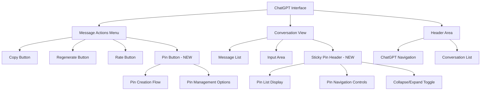
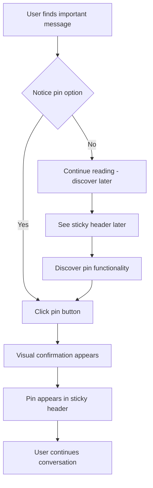
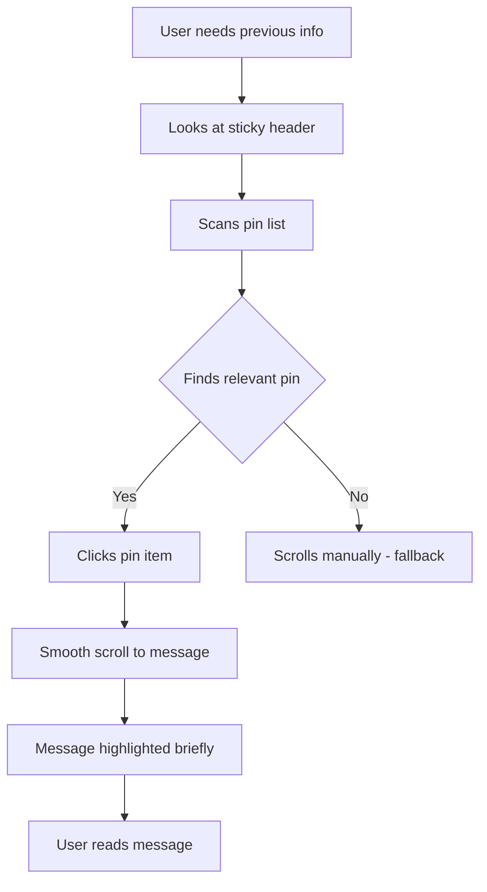
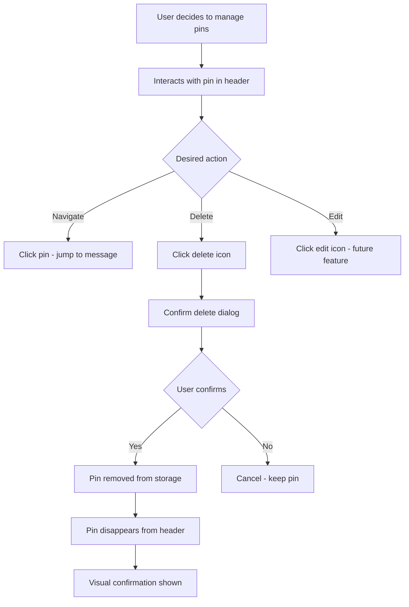

# ChatPinner UI/UX Specification

## Introduction

This document defines the user experience goals, information architecture, user flows, and visual design specifications for ChatPinner's user interface. It serves as the foundation for visual design and frontend development, ensuring a cohesive and user-centered experience.

## Overall UX Goals & Principles

### Target User Personas

**Primary: Professional ChatGPT Users**
- Developers, researchers, content creators, consultants, and knowledge workers
- Use ChatGPT extensively for complex projects and multi-hour sessions
- Need quick access to previously generated code, explanations, and decision points
- Work across multiple concurrent conversations

**Secondary: Educational and Personal Users**
- Students, lifelong learners, and personal users
- Conduct research conversations and learn complex topics
- Need to organize research findings and reference key explanations

### Usability Goals

- **Ease of learning**: New users can understand and use pinning within 2 minutes of first interaction
- **Efficiency of use**: Power users can pin and navigate messages with single-click actions
- **Error prevention**: Clear visual feedback for pin states and confirmation for destructive actions
- **Memorability**: Infrequent users can return to ChatGPT and immediately understand pin functionality

### Design Principles

1. **Seamless Integration** - Pinning should feel like a native ChatGPT feature, not an add-on
2. **Minimal Disruption** - Pin controls should not interfere with existing ChatGPT workflows
3. **Immediate Feedback** - Every pin action should have clear visual confirmation
4. **Performance First** - Extension must never slow down ChatGPT's native functionality
5. **Accessibility by Default** - All pin features must be keyboard navigable and screen reader friendly

## Information Architecture (IA)

Based on ChatPinner's requirements as a browser extension that integrates into ChatGPT's existing interface, the IA leverages ChatGPT's current patterns while adding pin functionality where users expect it.

### Site Map / Screen Inventory

Since ChatPinner integrates into ChatGPT's existing interface, our "site map" focuses on the UI components we're adding:



### Navigation Structure

**Primary Navigation:** ChatPinner doesn't introduce primary navigation - it leverages ChatGPT's existing navigation structure to maintain seamless integration.

**Secondary Navigation:**
- Pin controls appear in message action menus (contextual navigation)
- Sticky header provides quick access to pins within conversations
- Hover states and tooltips guide users to pin functionality

**Breadcrumb Strategy:** No breadcrumb navigation needed as ChatPinner operates within single conversations. Pin navigation uses direct scrolling to message locations rather than traditional page-based navigation.

## User Flows

### Flow 1: Creating a Pin

**User Goal:** Bookmark an important message for quick reference later

**Entry Points:** User scrolling through conversation, finds valuable information; User receives important response; User reviewing previous conversation

**Success Criteria:** User can pin a message within 3 seconds of deciding to do so, with clear visual confirmation



**Edge Cases & Error Handling:**
- User clicks pin button multiple times rapidly - debounce to prevent duplicate pins
- Message gets deleted after being pinned - remove pin from display and storage
- Storage quota exceeded - show user-friendly error with guidance
- Network issues during pin creation - queue operation and retry

**Notes:** Flow prioritizes speed and minimal disruption to existing ChatGPT workflow.

### Flow 2: Navigating to a Pin

**User Goal:** Quickly locate and view a previously pinned message

**Entry Points:** User needs previous info for current discussion; User wants to reference code snippet/explanation; User reviewing conversation notes

**Success Criteria:** User can navigate to any pin within 2 seconds of clicking it, with smooth scrolling and visual highlighting



**Edge Cases & Error Handling:**
- Pinned message no longer exists - remove pin and show notification
- Multiple pins with same content - ensure unique navigation to each instance
- User clicks rapidly between pins - queue navigation requests smoothly
- Page layout changes during scroll - re-calculate target position

**Notes:** Visual highlighting should be subtle but noticeable, lasting 2-3 seconds to draw attention without being distracting.

### Flow 3: Managing Pins

**User Goal:** Organize or remove existing pins

**Entry Points:** User sees too many pins in header; User wants to remove outdated pins; User wants to clean up conversation

**Success Criteria:** User can manage pins efficiently without leaving the conversation context



**Edge Cases & Error Handling:**
- User accidentally deletes pin - provide undo option for 5 seconds
- Delete operation fails - show retry option and keep pin in display
- User deletes all pins - collapse header automatically
- Storage corrupted - rebuild pin list from available messages

**Notes:** Delete confirmation should be minimal to maintain efficiency while preventing accidents.

## Wireframes & Mockups

For ChatPinner, we need to clarify the visual design approach since this is a browser extension that integrates into ChatGPT's existing interface. Let me define the strategy for creating visual designs.

## Design System Approach

**Design System Approach:** ChatPinner will use ChatGPT's existing design system as its foundation, specifically leveraging Tailwind v4 CSS classes that ChatGPT natively uses. This ensures seamless visual integration and maintains consistency with the host interface.

**Primary Design Files:** Visual designs will be created in Figma, with a dedicated component library for ChatPinner elements that can be easily referenced during development.

**Design Strategy:**
- Low-fidelity wireframes will be created to establish layout and positioning
- High-fidelity mockups will match ChatGPT's current visual design exactly
- Interactive prototypes will demonstrate user flows and micro-interactions
- Design system documentation will specify exact CSS classes and styling approaches

### ChatGPT Design System Variables (Extracted)

Based on the actual ChatGPT Tailwind v4 CSS files provided, here are the key design tokens:

**Color Palette:**
```css
/* Primary Colors */
--brand-purple: #ab68ff;
--main-surface-primary: var(--white) /* Light mode */;
--main-surface-secondary: var(--gray-50);
--main-surface-tertiary: var(--gray-100);
--text-primary: var(--gray-950);
--text-secondary: #0009;
--icon-secondary: #676767;

/* Dark Mode Variants */
--main-surface-primary: var(--gray-800) /* Dark mode */;
--main-surface-secondary: var(--gray-750);
--main-surface-tertiary: var(--gray-700);
--text-primary: var(--gray-100);
--text-secondary: #ffffffb3;
--icon-surface: 240 240 240;
```

**Typography Scale:**
```css
--text-xs: .75rem;
--text-sm: .875rem;
--text-base: 1rem;
--text-lg: 1.125rem;
--text-xl: 1.25rem;
--text-2xl: 1.5rem;
--text-heading-2: 1.5rem; /* font-weight: 600 */
--text-heading-3: 1.125rem; /* font-weight: 600 */
--text-body-regular: 1rem; /* font-weight: 400 */
--text-body-small-regular: .875rem; /* font-weight: 400 */
```

**Spacing System:**
```css
/* Uses CSS calc with --spacing variable */
calc(var(--spacing)*0) /* 0px */
calc(var(--spacing)*1) /* 4px base unit */
calc(var(--spacing)*2) /* 8px */
calc(var(--spacing)*3) /* 12px */
calc(var(--spacing)*4) /* 16px */
calc(var(--spacing)*6) /* 24px */
calc(var(--spacing)*8) /* 32px */
```

**Animation & Easing:**
```css
--spring-fast-duration: .667s;
--spring-common-duration: .667s;
--spring-bounce-duration: .833s;
--easing-common: linear(0,0,.0001,.0002...); /* Complex easing function */
--transition-duration: 0.1s; /* For hover states */
```

## Key Screen Layouts

### Screen 1: ChatGPT Message with Pin Button

**Purpose:** Show how the pin button integrates into ChatGPT's existing message action menu

**Key Elements:**
- Pin button positioned alongside existing action buttons using `calc(var(--spacing)*2)` spacing
- Background uses `var(--main-surface-secondary)` on hover
- Icon color uses `var(--icon-secondary)` default state
- Border radius matches ChatGPT's standard `8px`
- Button size: `32px × 32px` with `display: flex` and `justify-content: center`

**CSS Classes to Use:**
```css
/* Base button styles */
.p-1 /* calc(var(--spacing)*1) padding */
.rounded-lg /* 8px border radius */
.color-[var(--icon-secondary)]
.transition-[background-color_0.1s_linear]

/* Hover states */
@media (hover: hover) and (pointer: fine) {
  .hover:bg-[var(--main-surface-secondary)]
}

/* Active/pinned state */
.color-[var(--brand-purple)]
.bg-[var(--main-surface-secondary-selected)]
```

**Interaction Notes:**
- Single click creates pin with visual confirmation using ChatGPT's spring animations
- Hover state transitions use `0.1s linear` timing
- Success state changes icon color to `var(--brand-purple)`
- Use ChatGPT's `--spring-common` easing for success animations

**Design File Reference:** Figma Frame: "Message with Pin Button"

### Screen 2: Sticky Pin Header

**Purpose:** Display all pins for the current conversation in a collapsible header

**Key Elements:**
- Background uses `var(--main-surface-primary)` with subtle border
- Header height: `auto` with `py-2` (calc(var(--spacing)*2) padding)
- Pin items use `text-sm` (.875rem) and `text-body-small-regular`
- Each pin item has `px-3 py-2` spacing and hover states
- Max height: `200px` with scroll overflow for many pins

**CSS Classes to Use:**
```css
/* Header container */
.bg-[var(--main-surface-primary)]
.border-b /* Bottom border using ChatGPT's neutral colors */
.sticky top-0 /* Positioning */
.z-10 /* Layer below ChatGPT's main nav */

/* Pin list items */
.px-3 py-2 /* calc(var(--spacing)*3) and calc(var(--spacing)*2) */
.text-sm /* .875rem font size */
.text-[var(--text-secondary)]
.hover:bg-[var(--main-surface-secondary)]
.rounded /* 4px border radius for list items */

/* Pin counter */
.text-xs /* .75rem */
.font-semibold /* 600 font weight */
.color-[var(--brand-purple)]
```

**Interaction Notes:**
- Click pin item for smooth scroll using `scroll-behavior: smooth`
- Delete confirmation uses subtle scale transform with `--spring-fast` easing
- Auto-collapse animation uses `--spring-common` duration and easing
- Responsive adaptation below `768px` reduces padding to `py-1`

**Design File Reference:** Figma Frame: "Sticky Pin Header"

### Screen 3: Empty State and Discovery

**Purpose:** Guide users to discover pin functionality when they haven't used it yet

**Key Elements:**
- Empty state text uses `text-xs` (.75rem) and `text-[var(--text-secondary)]`
- Discovery tooltip uses ChatGPT's tooltip styling with `var(--main-surface-tertiary)`
- First-use celebration animation uses `--spring-bounce` easing
- Help icon uses `var(--icon-secondary)` color

**CSS Classes to Use:**
```css
/* Empty state */
.text-xs /* .75rem */
.text-[var(--text-secondary)]
.font-light /* 300 font weight */
.px-3 py-2 /* Consistent padding */

/* Discovery tooltip */
.bg-[var(--main-surface-tertiary)]
.rounded-lg /* 8px border radius */
.shadow-md /* Subtle shadow */
.px-2 py-1 /* Compact padding */

/* Celebration animation */
.animate-[bounce_0.5s_var(--spring-bounce)]
.color-[var(--brand-purple)]
```

**Interaction Notes:**
- Empty state appears only when header is expanded and no pins exist
- Discovery tooltip shows after 2 seconds of inactivity on first visit
- Celebration animation triggers only once per user session
- Help text disappears automatically after user creates first pin

**Design File Reference:** Figma Frame: "Discovery and Empty States"

## Next Steps

### Immediate Actions

1. **Review Specification with Stakeholders**
   - Present complete UI/UX specification for approval
   - Gather feedback on design decisions and technical approach
   - Validate component library and interaction patterns
   - Confirm responsive strategy for ChatGPT interface

2. **Create/Update Visual Designs in Figma**
   - Build high-fidelity mockups using extracted ChatGPT design tokens
   - Create component library with essential MVP components only
   - Develop simple prototype demonstrating core pin flow
   - Document design system with exact CSS variables

3. **Prepare for Development Handoff**
   - Prioritize components by MVP implementation order
   - Create developer documentation with essential code examples
   - Set up Figma developer handoff with core components
   - Prepare CSS variable integration guide

4. **Technical Architecture Setup**
   - Configure Plasmo development environment for React extension
   - Set up basic component structure for MVP
   - Create CSS variable integration with ChatGPT's design system
   - Establish basic testing for core functionality

### MVP Implementation Priority (1-Week Timeline)

**Day 1-2: Core Foundation**
1. **Pin Button Component** - Basic message pinning with visual feedback
2. **Storage Layer** - LocalStorage integration with basic CRUD operations
3. **DOM Integration** - Reliable injection into ChatGPT message action menus

**Day 3-4: Essential Functionality**
1. **Basic Pin Header** - Simple list display with collapse/expand
2. **Pin Navigation** - Smooth scrolling to pinned messages
3. **Pin Management** - Delete functionality with basic confirmation

**Day 5-6: Critical Polish**
1. **Error Handling** - Essential edge cases and storage limit management
2. **Basic Responsive Design** - Mobile and desktop compatibility
3. **Core Micro-interactions** - Essential hover states and transitions

**Day 7: Launch Preparation**
1. **Cross-browser Testing** - Chrome, Firefox compatibility
2. **Basic Accessibility** - Keyboard navigation and ARIA labels
3. **Store Submission** - Extension store listing preparation

### Post-MVP Enhancements (After Launch)

**Week 2-3: Polish & Optimization**
- Advanced micro-interactions and animations
- Discovery features and user guidance
- Performance optimization and memory management
- Full responsive design for all breakpoints
- Complete cross-browser compatibility (Safari, Edge)

**Week 4: Professional Features**
- Comprehensive accessibility testing (WCAG 2.1 AA)
- User testing and feedback integration
- Documentation and user guides
- Advanced error handling and recovery

### Design Handoff Checklist (MVP Focus)

**Essential Visual Design Assets:**
- [ ] Core component designs (Pin Button, Pin Header, Pin Item)
- [ ] Component library with MVP states and variants
- [ ] Simple prototype demonstrating pin creation and navigation
- [ ] Design system documentation with essential CSS variables
- [ ] Export-ready SVG icons for core interface elements
- [ ] Basic responsive mockups for mobile and desktop

**Critical Technical Specifications:**
- [ ] Core component API definitions with essential props
- [ ] CSS class mapping to ChatGPT's primary design variables
- [ ] Basic animation specifications for core interactions
- [ ] Essential accessibility requirements (ARIA labels, keyboard navigation)
- [ ] Performance targets for MVP functionality
- [ ] Chrome and Firefox compatibility requirements

**Implementation Guidelines:**
- [ ] Simplified component structure for MVP
- [ ] Integration patterns with ChatGPT's DOM elements
- [ ] Basic error handling for critical edge cases
- [ ] Simple testing approach for core functionality
- [ ] Store submission strategy for MVP launch
- [ ] Basic documentation for MVP maintenance

### Open Questions & Decisions Needed (MVP Focus)

**Critical Technical Decisions:**
1. **Storage Strategy:** Confirm localStorage approach for MVP pin data persistence
2. **DOM Injection Timing:** Determine reliable moment to inject pin components
3. **CSS Loading Strategy:** Choose between inline styles or CSS injection for MVP
4. **Component Updating:** Define basic strategy for ChatGPT DOM changes
5. **Performance Monitoring:** Establish basic performance measurement for MVP

**Essential Design Decisions:**
1. **MVP Feature Scope:** Confirm which features are essential for 1-week launch
2. **Basic User Onboarding:** Determine minimal discovery approach for MVP
3. **Core Error Handling:** Define essential error messaging for MVP
4. **Mobile Support:** Confirm basic mobile compatibility for MVP
5. **Animation Scope:** Define essential micro-interactions for MVP timeline

### MVP Success Metrics

**Technical Metrics (1-Week Target):**
- Extension load time < 200ms for Chrome and Firefox
- Memory usage < 30MB during normal operation
- Zero impact on ChatGPT's native page load performance
- 95% uptime for basic pin storage and retrieval operations
- Chrome and Firefox compatibility score > 90%

**User Experience Metrics (MVP):**
- Pin creation success rate > 95%
- Average time to create pin < 5 seconds from decision
- Pin navigation accuracy > 90% (correct message targeting)
- User error rate < 10% for core operations
- Basic accessibility compliance for keyboard navigation

**Launch Metrics (MVP):**
- Basic user adoption > 50% within first week of installation
- Average pins per user > 3 per week
- Pin re-access rate > 70% within 24 hours of creation
- User retention rate > 40% after 30 days
- Store review rating > 4.0 stars on Chrome and Firefox

## Change Log

| Date | Version | Description | Author |
|------|---------|-------------|---------|
| 2025-10-19 | v1.0 | Initial UI/UX specification creation | Sally (UX Expert) |
| 2025-10-19 | v1.1 | Added Information Architecture and User Flows | Sally (UX Expert) |
| 2025-10-19 | v1.2 | Added Wireframes & Mockups with actual ChatGPT design system | Sally (UX Expert) |
| 2025-10-19 | v1.3 | Added Component Library, Micro-interactions, Responsive Design, and Cross-Browser Compatibility | Sally (UX Expert) |
| 2025-10-19 | v2.0 | Complete specification with 1-Week MVP timeline and Implementation Plan | Sally (UX Expert) |